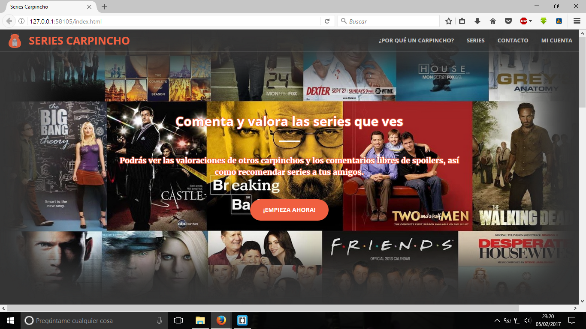
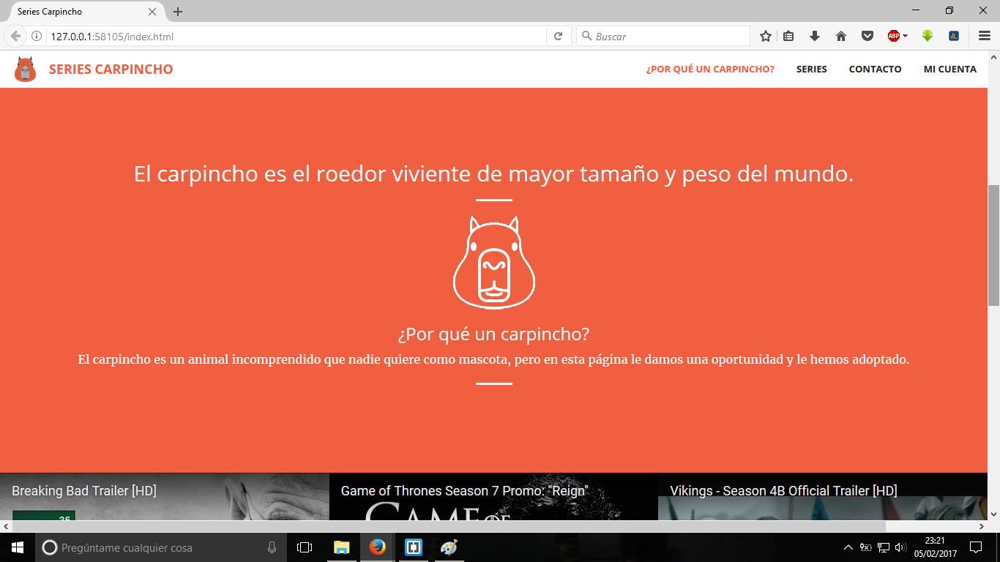
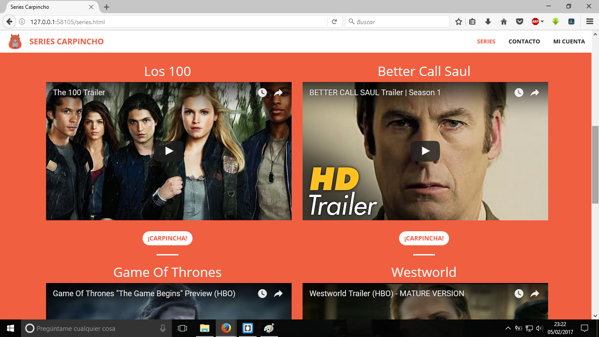
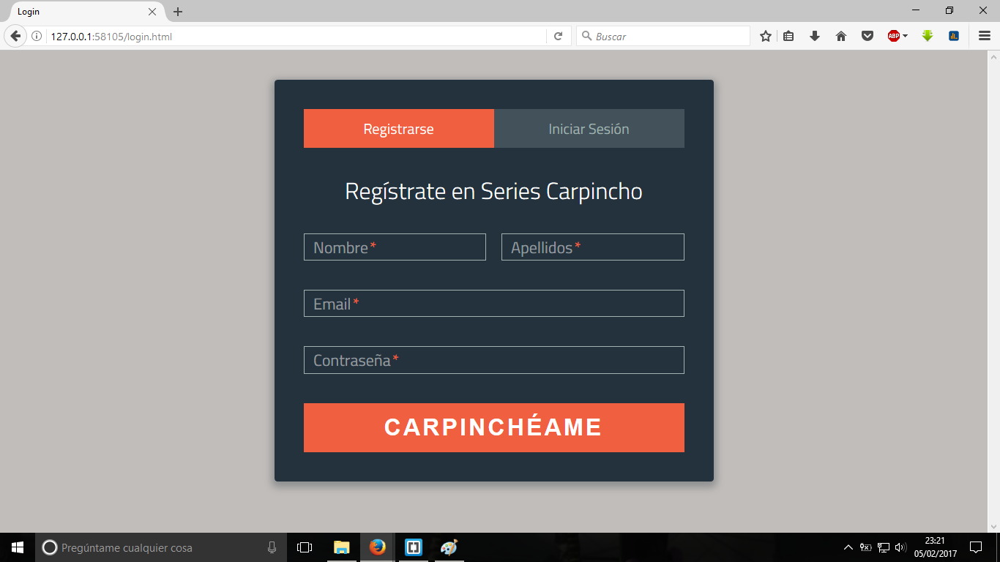
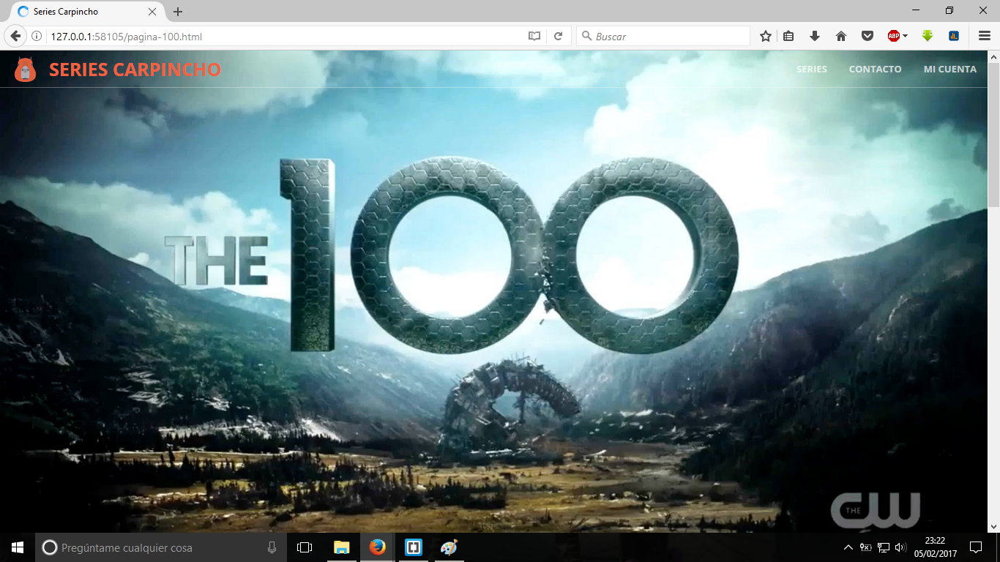
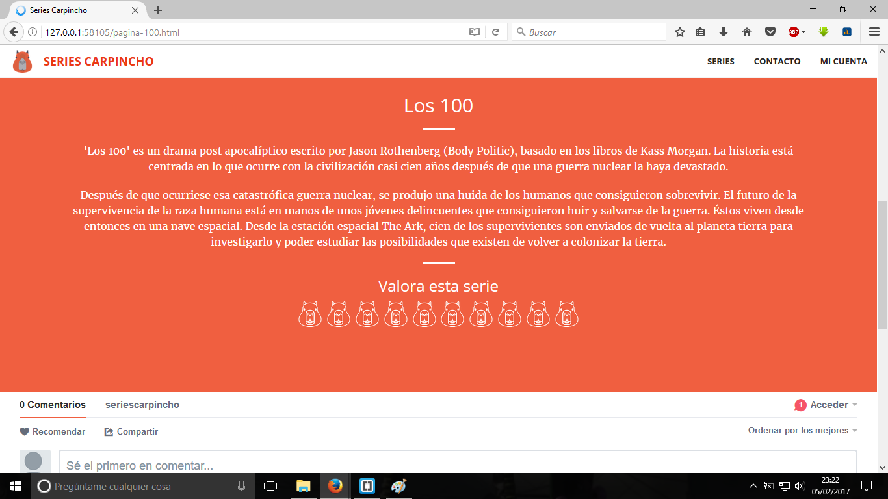
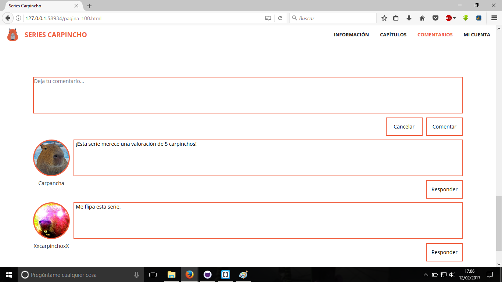
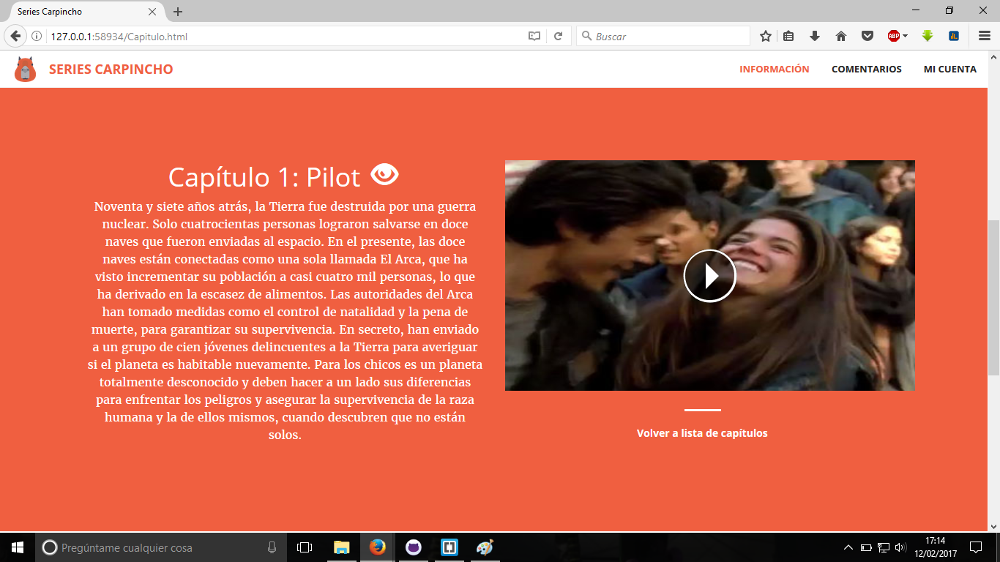

#Práctica DAW: Diseña e implementa una aplicación web
###Nombre de la aplicación
Series Carpincho
###Descripción
Se trata de una web para comentar y calificar series de tv, puedes añadir tus series favoritas y recomendarlas a tus amigos.
###Entidades
  - Serie: Conjunto de capítulos que constituyen la serie, se puede comentar, valorar y marcar como serie favorita.
  - Capítulo: Partes en las que se divide una serie, se pueden marcar como visto y comentar.
  - Usuario: Persona humana que utiliza la web. Los usuarios pueden tener una lista de series favoritas (privada) y recomendadas (pública) y acceder al perfil de sus amigos.
  - Comentarios: Si un comentario contiene spoiler no se muestra a los usuarios que no han visto ese capítulo.
  - Valoraciones: Puntuación que se le da a una serie. La valoración va del 1 al 5.   
  
###Integrantes                                                                                         
  - Enrique Sánchez-Migallón Porras, e.sanchezpo@alumnos.urjc.es, https://github.com/erkike  
  - Christian Alcaide Moreno, c.alcaidemor@alumnos.urjc.es, https://github.com/ChristianAm7  
  - Sergio Cerezuela González, s.cerezuela@alumnos.urjc.es, https://github.com/scgvk  
  - Fernando Castro García, f.castrog@alumnos.urjc.es, https://github.com/fcastrog  

###Capturas
####Página Principal:
 
####Información: en la página principal
 
####Listado Series:
 
####Contacto:
 
####Login:
 
####Página de una Serie: información
 
####Página de una Serie: lista de capítulos
 
####Página de una Serie: comentarios
 
####Página de un capítulo:
 
  
###Fuentes:
  - https://graygrids.com/item/free-bootstrap-admin-template-zontal-admin/ Plantilla CSS usada en la página de perfil de usuario
  
  - https://startbootstrap.com/template-overviews/creative/ Plantilla utilizada para toda la página.
  De esta plantilla hemos mantenido la cabecera, y la estructura. El resto lo hemos adaptado con el contenido que necesitamos para nuestra web.
