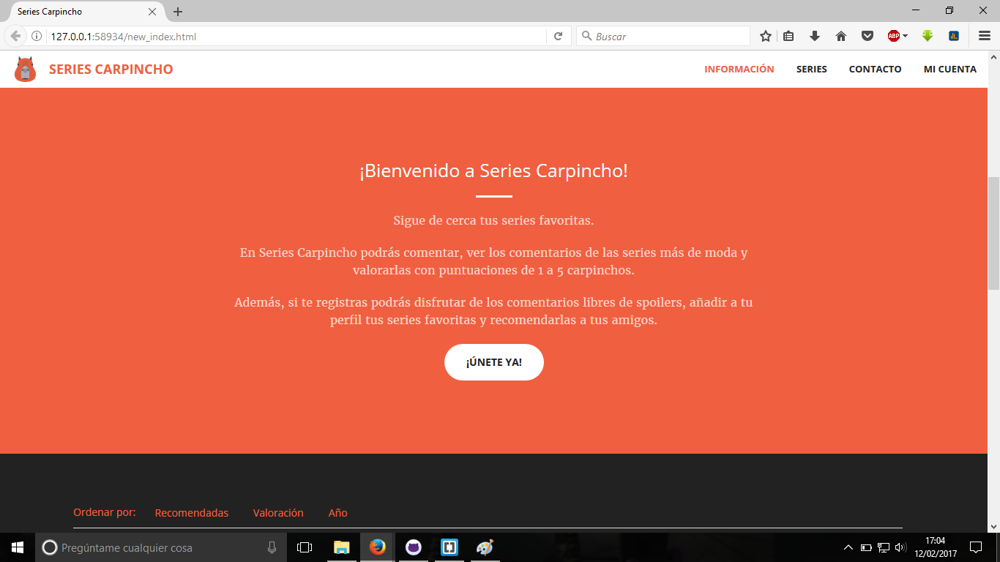
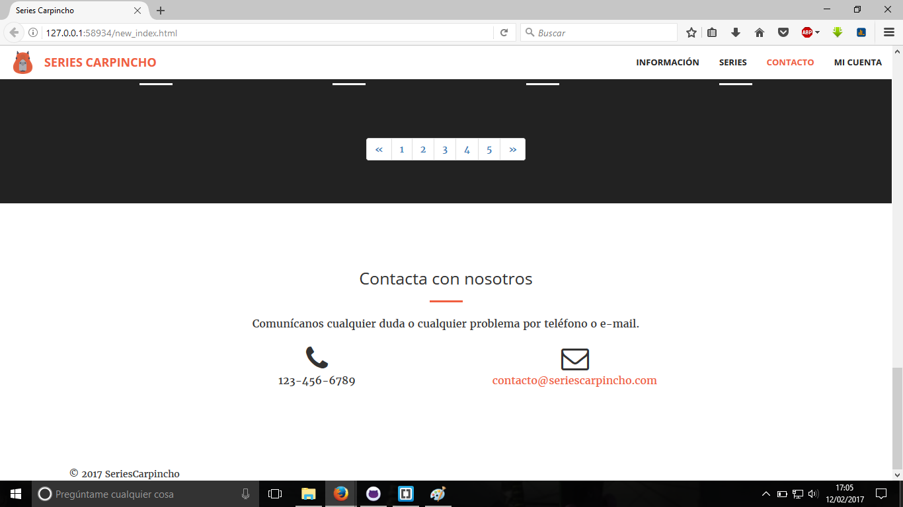
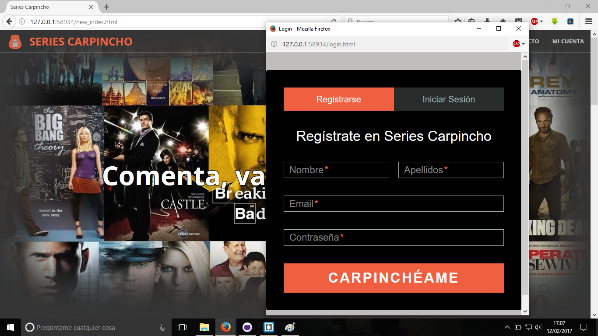
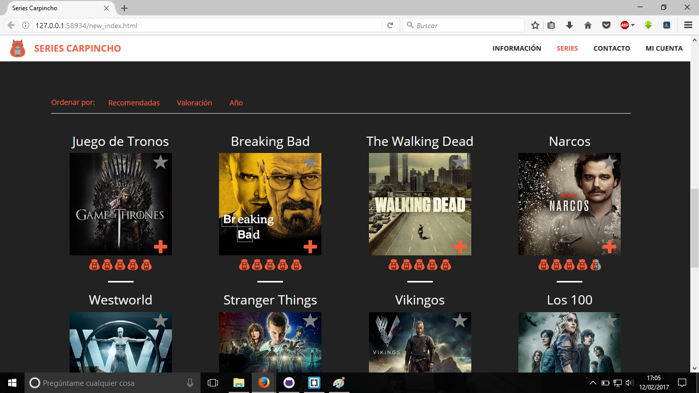
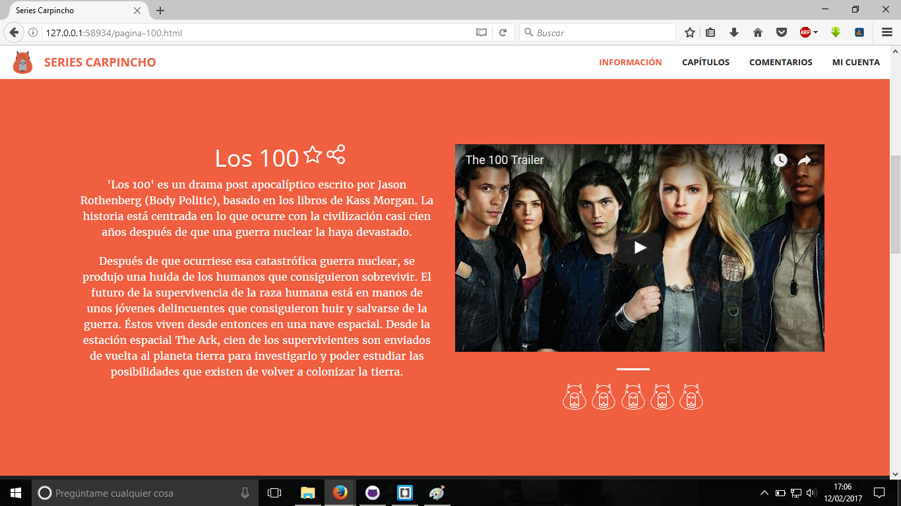
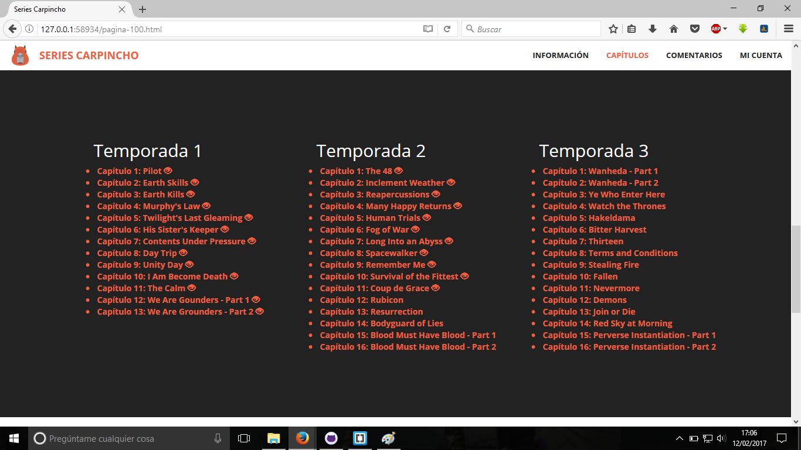

#Práctica DAW: Diseña e implementa una aplicación web
###Nombre de la aplicación
Series Carpincho
###Descripción
Se trata de una web para comentar y calificar series de tv, puedes añadir tus series favoritas y recomendarlas a tus amigos.
###Entidades
  - Serie: Conjunto de capítulos que constituyen la serie, se puede comentar, valorar y marcar como serie favorita. Las Series se encuentran ordenas en función de las valoraciones.
  - Capítulo: Partes en las que se divide una serie, al igual que la serie se puede comentar, valorar y marcar como visto.
  - Usuario: Persona humana que utiliza la web. Los usuario pueden mandar solicitudes de amistad a otros usuarios y acceder al perfil de sus amigos.
  - Comentarios/Valoraciones: Puntuación que se le da a una serie o capítulo. Esta compuesta de una puntuación del 1 al 10 y un cuadro de texto. Si un comentario contiene spoiler no se muestra a los usuarios que no han visto ese capítulo.
  - Recomendación: Mensaje para recomendar una serie que se puede transmitir de dos formas: de un usuario a otro usuario, o de la propia aplicación web a un usuario (basandose en sus series favoritas y sus amigos).  
  
###Integrantes                                                                                         
  - Enrique Sánchez-Migallón Porras, e.sanchezpo@alumnos.urjc.es, https://github.com/erkike  
  - Christian Alcaide Moreno, c.alcaidemor@alumnos.urjc.es, https://github.com/ChristianAm7  
  - Sergio Cerezuela González, s.cerezuela@alumnos.urjc.es, https://github.com/scgvk  
  - Fernando Castro García, f.castrog@alumnos.urjc.es, https://github.com/fcastrog  

###Capturas
  -  Página principal
  -  
  - 
  -  Login
  -  Lista Series
  -  Página Serie
  - 
  - 
  
  ###Fuentes:
  - https://graygrids.com/item/free-bootstrap-admin-template-zontal-admin/ Plantilla CSS usada en la página de perfil de usuario
  - https://startbootstrap.com/template-overviews/creative/ Plantilla CSS usada en el resto de páginas